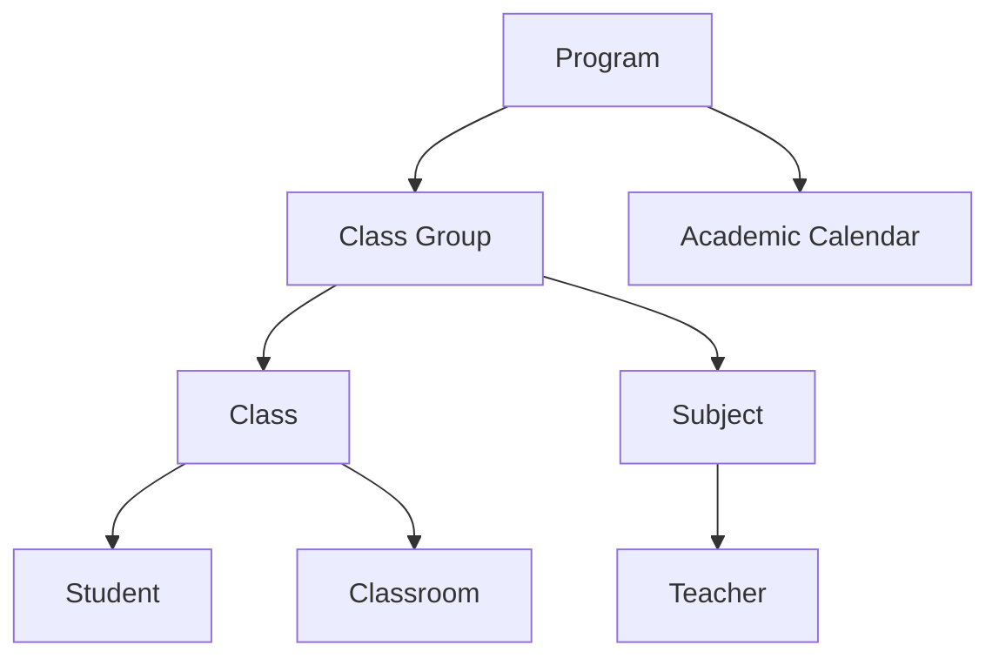
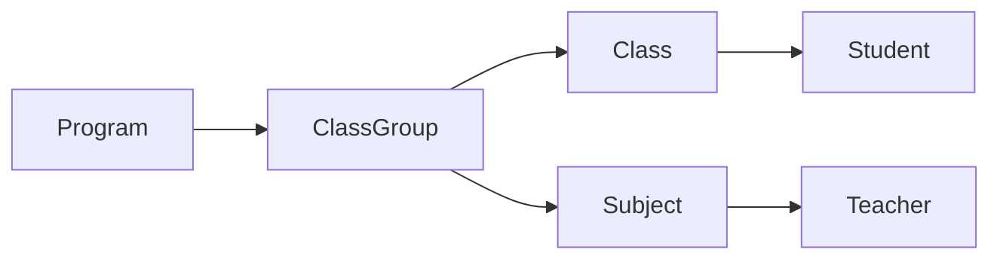
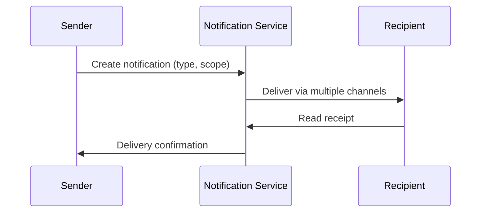
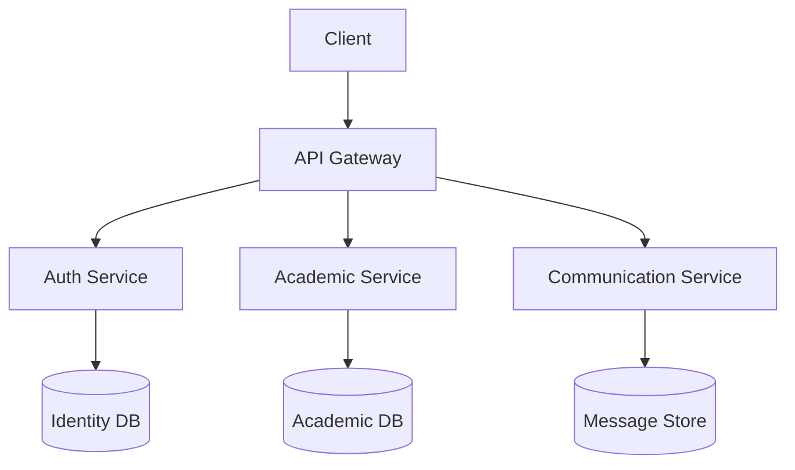

# Learning Experience Platform (LXP) - Consolidated Requirements

## 1. System Overview
### 1.1 Platform Purpose
- Unified system for managing academic structures, resources, and stakeholder collaboration
- Role-based portals for: Super Admin, Program Coordinators, Teachers, Students, Parents

### 1.2 Core Entities


## 2. Core System Requirements

### 2.1 Academic Management
#### Academic Calendar
- Term configuration with start/end dates
- Event management (holidays, exams, activities)
- Recurring event support

#### Program Structure


### 2.2 Role-Based Portals

#### 2.2.1 Super Admin Portal
- System-wide configuration
- User management (CRUD for all roles)
- Global permissions management
- Audit logs and system metrics

#### 2.2.2 Program Coordinator Portal
- Program-specific academic management
- Class group/class oversight
- Teacher coordination tools
- Performance analytics dashboard

#### 2.2.3 Teacher Portal
| Feature              | Class Teacher               | Subject Teacher             |
|----------------------|-----------------------------|-----------------------------|
| Attendance           | Class-level tracking        | Subject-specific tracking   |
| Grading              | Consolidated evaluations    | Subject-specific rubrics    |
| Communication        | Parent/student messaging    | Cross-class coordination    |

#### 2.2.4 Student Portal
- Academic dashboard
- Learning resource access
- Assignment submission system
- Performance tracking

#### 2.2.5 Parent Portal
- Multi-child support
- Academic progress monitoring
- Communication center
- Event/attendance tracking

### 2.3 Unified Features

#### Notification System


#### Messaging System
- Role-based communication channels
- File attachment support
- Conversation threading
- Read receipts/history

### 2.4 Data Management

#### Entity Relationships
```mermaid
erDiagram
    PROGRAM ||--o{ CLASS_GROUP : contains
    CLASS_GROUP ||--o{ CLASS : contains
    CLASS ||--o{ STUDENT : has
    CLASS_GROUP ||--o{ SUBJECT : offers
    SUBJECT ||--o{ TEACHER : assigned
```

#### Data Retention
- GDPR-compliant storage policies
- Role-based data access controls
- Automated retention period enforcement

## 3. Technical Requirements

### 3.1 System Architecture


### 3.2 Security Requirements
- Role-Based Access Control (RBAC)
- GDPR compliance tools
- End-to-end encryption for communications
- Audit logging

### 3.3 Integration Points
- SMS/Email gateways
- Payment processors
- Learning Tools Interoperability (LTI)
- BI tools for analytics

## 4. Non-Functional Requirements

### 4.1 Performance
- <500ms response time for core operations
- Support 500 concurrent users per instance

### 4.2 Reliability
- 99.9% uptime SLA
- Automated backup/recovery

### 4.3 Scalability
- Horizontal scaling support
- Load-balanced architecture

## 5. Version History
- v1.0 (2024-03-15): Initial requirements
- v1.1 (2024-06-20): Added role portal specifications
- v2.0 (2024-07-01): Consolidated structure
