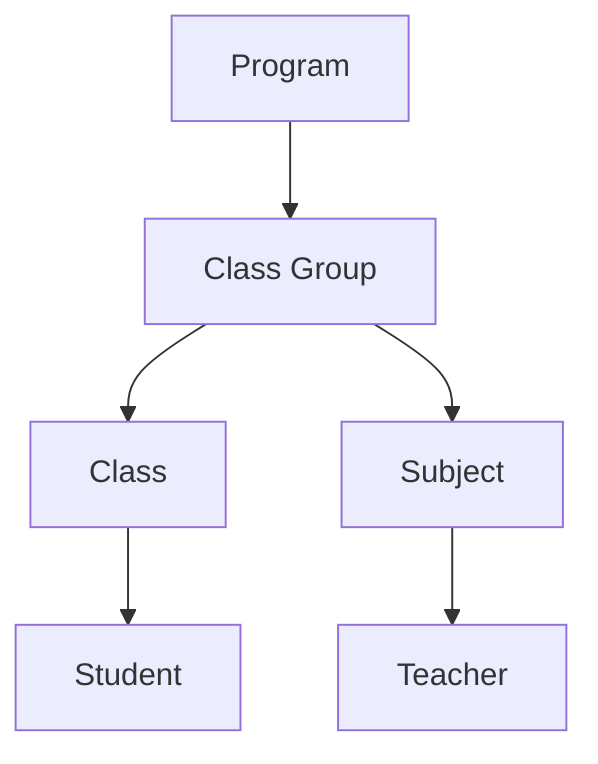
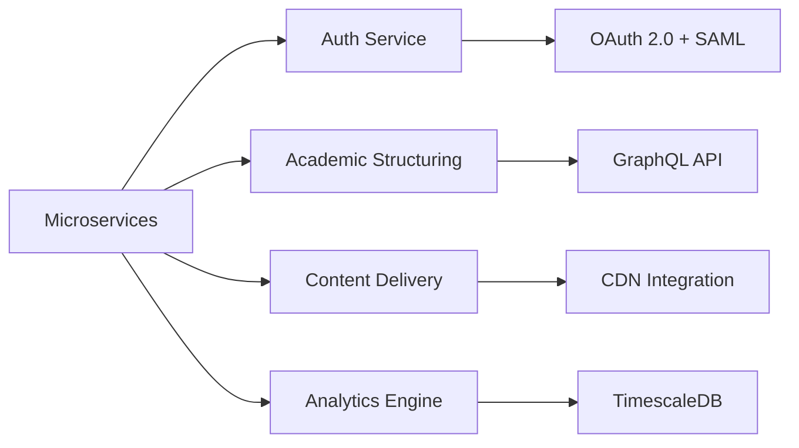

# Learning Experience Platform (LXP) - Consolidated Requirements Specification

## 1. System Overview
A unified platform for managing academic operations with role-based portals for:
- Super Administrators
- Program Coordinators
- Teachers (Class/Subject)
- Students
- Parents

## 2. Core Features

### 2.1 Academic Structure Management


#### 2.1.1 Hierarchical Management
- Programs > Class Groups > Classes
- Inherited timetables and academic calendars
- Cascading notification system

### 2.2 Role-Based Portals Matrix

| Feature                | Super Admin | Coordinator | Teacher | Student | Parent |
|------------------------|-------------|-------------|---------|---------|--------|
| Academic Calendar      | Full        | Program     | Class   | View    | View   |
| User Management        | Full        | Requests    | -       | -       | -      |
| Content Authoring      | -           | Approve     | Create  | -       | -      |
| Assessment Management  | Audit       | Oversee     | Full    | Submit  | View   |
| System Configuration   | Full        | -           | -       | -       | -      |

### 2.3 Notification System
- Tiered delivery hierarchy:
  1. System-wide (Super Admin)
  2. Program-level (Coordinator)
  3. Class-level (Teachers)
  4. Individual (Students/Parents)

## 3. User Roles & Permissions

### 3.1 Super Administrator
- **System Configuration**
  - Manage global academic calendars
  - Define permission templates
  - Audit trails and access logs
- **UI Components**
  - System health dashboard
  - Role configuration interface

### 3.2 Program Coordinator
- **Program Operations**
  - Timetable design and conflict resolution
  - Cross-class resource allocation
  - Teacher performance monitoring
- **UI Requirements**
  - Program analytics dashboard
  - Bulk operation tools

### 3.3 Teacher Portal
**Dual Role Management:**
```typescript
interface TeacherProfile {
  classResponsibilities: ClassTeacherDuties[];
  subjectAssignments: SubjectTeaching[];
  availability: TeachingSchedule;
}
```

#### Key Features:
- Integrated gradebook with AI-assisted grading
- Behavior tracking system with pattern detection
- Parent communication toolkit

### 3.4 Student Portal
- Interactive learning timeline
- Skill gap analysis reports
- Peer comparison tools (opt-in)

### 3.5 Parent Portal
- Multi-child dashboard
- Payment integration system
- Behavior alert escalation path

## 4. Technical Architecture

### 4.1 MVP Scalability Plan


### 4.2 Key Integration Points
- IMS Global LTI 1.3 for LMS integration
- xAPI for learning activity tracking
- CalDAV for calendar synchronization

## 5. Data Requirements

### 5.1 Core Entities
```graphql
type Program {
  id: ID!
  name: String!
  calendar: AcademicCalendar
  classGroups: [ClassGroup!]!
}

type ClassGroup {
  subjects: [Subject!]!
  timetable: Timetable!
  classes: [Class!]!
}
```

### 5.2 Analytics Requirements
- Real-time websocket updates for attendance
- Columnar storage for assessment data
- Graph database for relationship mapping

## 6. UI/UX Specifications

### 6.1 Design System
- Role-specific color coding
- Accessibility-first components (WCAG 2.1 AA)
- Responsive layout grid system

### 6.2 Dashboard Standards
- Consolidated widget library
- Context-aware help system
- Performance-optimized data tables

## 7. Compliance & Security
- GDPR-compliant audit trails
- JWT-based session management
- FERPA-compliant data isolation

## 8. API Endpoints
| Service          | Endpoints                              | Rate Limit     |
|------------------|----------------------------------------|----------------|
| Academic Struct  | /programs, /classgroups, /timetables   | 1000 req/min   |
| User Management  | /users, /roles, /permissions           | 500 req/min    |
| Content Delivery | /materials, /assignments, /submissions | 2000 req/min   |

## 9. Roadmap

### Q3 2024
- AI-powered recommendation engine
- LTI 1.3 certification
- Mobile app beta

### Q4 2024
- Learning analytics integration
- Parent payment gateway
- SSO implementation
